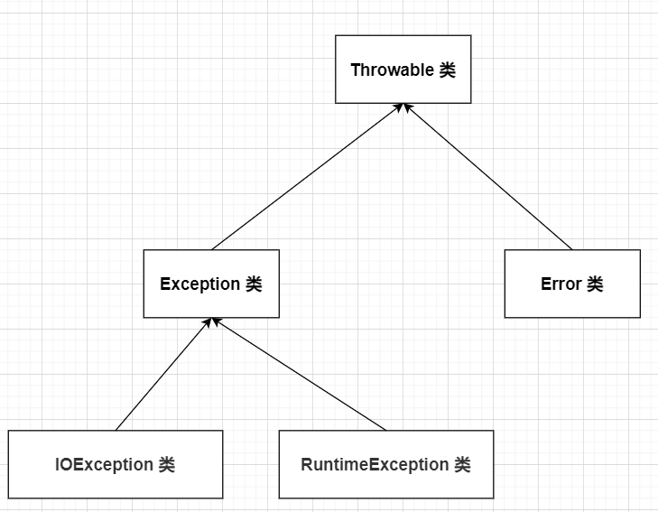

# Java异常处理

## 什么是异常处理？

在Java中，异常就是Java在编译或运行或者运行过程中出现的错误。

Java程序运行的过程中一般有三种类型的异常：

+ 检查性异常


+ 运行时异常


+ 错误

## 什么是Exception类？

所有的异常类是从 java.lang.Exception 类继承的子类。Exception类有一个父类是Throwable，Throwable类还有另外一个子类是Error。下图表明它们之间的关系。




派生于Error和Runtime Exception属于 **未检查异常**，派生于 IOException属于 **已检查异常**。

**未检查异常：**

| **异常**                          | **描述**                                   |
| ------------------------------- | ---------------------------------------- |
| ArithmeticException             | 当出现异常的运算条件时，抛出此异常。例如，一个整数"除以零"时，抛出此类的一个实例。 |
| ArrayIndexOutOfBoundsException  | 用非法索引访问数组时抛出的异常。如果索引为负或大于等于数组大小，则该索引为非法索引。 |
| ArrayStoreException             | 试图将错误类型的对象存储到一个对象数组时抛出的异常。               |
| ClassCastException              | 当试图将对象强制转换为不是实例的子类时，抛出该异常。               |
| IllegalArgumentException        | 抛出的异常表明向方法传递了一个不合法或不正确的参数。               |
| IllegalMonitorStateException    | 抛出的异常表明某一线程已经试图等待对象的监视器，或者试图通知其他正在等待对象的监视器而本身没有指定监视器的线程。 |
| IllegalStateException           | 在非法或不适当的时间调用方法时产生的信号。换句话说，即 Java 环境或 Java 应用程序没有处于请求操作所要求的适当状态下。 |
| IllegalThreadStateException     | 线程没有处于请求操作所要求的适当状态时抛出的异常。                |
| IndexOutOfBoundsException       | 指示某排序索引（例如对数组、字符串或向量的排序）超出范围时抛出。         |
| NegativeArraySizeException      | 如果应用程序试图创建大小为负的数组，则抛出该异常。                |
| NullPointerException            | 当应用程序试图在需要对象的地方使用 `null` 时，抛出该异常         |
| NumberFormatException           | 当应用程序试图将字符串转换成一种数值类型，但该字符串不能转换为适当格式时，抛出该异常。 |
| SecurityException               | 由安全管理器抛出的异常，指示存在安全侵犯。                    |
| StringIndexOutOfBoundsException | 此异常由 `String` 方法抛出，指示索引或者为负，或者超出字符串的大小。  |
| UnsupportedOperationException   | 当不支持请求的操作时，抛出该异常。                        |

**检查性异常：**

| ClassNotFoundException     | 应用程序试图加载类时，找不到相应的类，抛出该异常。                |
| -------------------------- | ---------------------------------------- |
| CloneNotSupportedException | 当调用 `Object` 类中的 `clone` 方法克隆对象，但该对象的类无法实现 `Cloneable` 接口时，抛出该异常。 |
| IllegalAccessException     | 拒绝访问一个类的时候，抛出该异常。                        |
| InstantiationException     | 当试图使用 `Class` 类中的 `newInstance` 方法创建一个类的实例，而指定的类对象因为是一个接口或是一个抽象类而无法实例化时，抛出该异常。 |
| InterruptedException       | 一个线程被另一个线程中断，抛出该异常。                      |
| NoSuchFieldException       | 请求的变量不存在                                 |
| NoSuchMethodException      | 请求的方法不存在                                 |

 **Throwable 类的主要方法：**

| 1    | **public String getMessage()**返回关于发生的异常的详细信息。这个消息在Throwable 类的构造函数中初始化了。 |
| ---- | ---------------------------------------- |
| 2    | **public Throwable getCause()**返回一个Throwable 对象代表异常原因。 |
| 3    | **public String toString()**使用getMessage()的结果返回类的串级名字。 |
| 4    | **public void printStackTrace()**打印toString()结果和栈层次到System.err，即错误输出流。 |
| 5    | **public StackTraceElement [] getStackTrace()**返回一个包含堆栈层次的数组。下标为0的元素代表栈顶，最后一个元素代表方法调用堆栈的栈底。 |
| 6    | **public Throwable fillInStackTrace()**用当前的调用栈层次填充Throwable 对象栈层次，添加到栈层次任何先前信息中。 |

## 如何捕获异常？

使用 **try...catch** 代码块儿

```java
try
{
   // 程序代码
}catch(ExceptionName e1)
{
   //Catch 块
}
```

**多重捕获**

```java
 try{
    // 程序代码
 }catch(异常类型1 异常的变量名1){
    // 程序代码
 }catch(异常类型2 异常的变量名2){
    // 程序代码
 }catch(异常类型2 异常的变量名2){
    // 程序代码
 }
```

**throws/throw关键字**

```java
 public void fun(double m1) throws IOException
 {
   // 函数实现
   throw new RemoteException();
 }
```

**finally关键字**

```java
 try{
    // 程序代码
 }catch(异常类型1 异常的变量名1){
    // 程序代码
 }catch(异常类型2 异常的变量名2){
    // 程序代码
 }finally{
    // 程序代码
   // 必须会被执行的部分
 }
```

## Java中可以声明一个自定义的异常，如何声明？

注意下面几点：

- 所有异常都必须是 Throwable 的子类。
- 如果希望写一个检查性异常类，则需要继承 Exception 类。
- 如果你想写一个运行时异常类，那么需要继承 RuntimeException 类。

**通用异常**

 Java 中定义了两种类型的异常和错误。

- **JVM(Java虚拟机) 异常：**由 JVM 抛出的异常或错误。例如：`NullPointerException类`，`ArrayIndexOutOfBoundsException类`，`ClassCastException类`。
- **程序级异常：**由程序或者API程序抛出的异常。例如 `IllegalArgumentException类`，`IllegalStateException类`。

